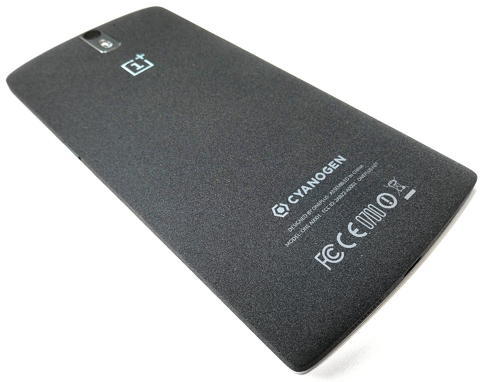
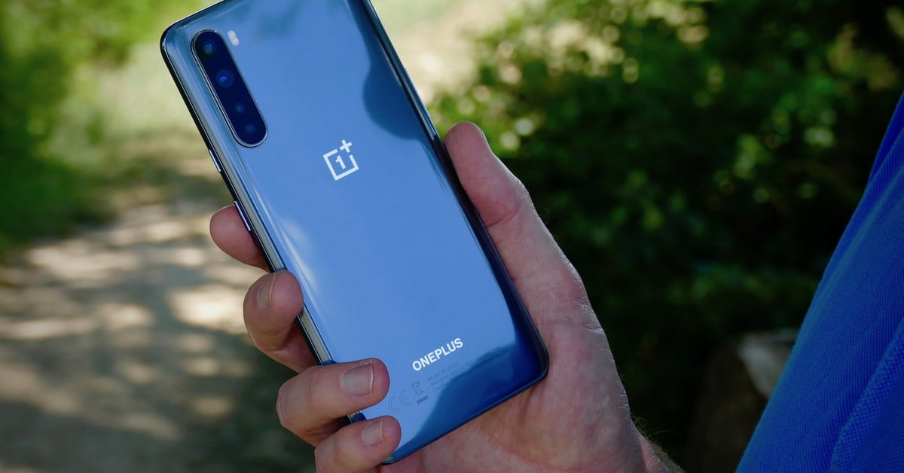
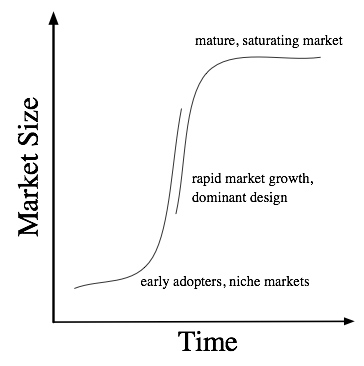

Back in April 2014, [OnePlus](https://www.oneplus.in/), an unknown manufacturer unveiled its first phone, the [OnePlus One](https://en.wikipedia.org/wiki/OnePlus_One), which was great value for money smartphone. It was the flagship killer of that year and loved by a large group of people.

It came with 5.5 inch Full HD display, 3GB of RAM, Snapdragon 801 processor, and with a very customizable custom ROM, [CyanogenMod](https://en.wikipedia.org/wiki/CyanogenMod) which is currently discontinued. And, if you know how the smartphone market was then, these were some killer specs which you could find in that price range. And, if you'd ask me what made this phone a flagship? I'd say the "**Sandstone Black**" 😍.

Now, 6 years later, the smartphone market has been flooded with many, trust me, many wannabe flagship killers. So many phones are coming with great specs, yes! But they all have stopped inventing something "**new**".

Unfortunately, after the great success of OnePlus One, its successors were somewhat failed to impress its customer base. OnePlus started to move from "Never Settle" to "**Settle for Money**". The prices were increased for each version of the phone, and in 2020 the price of [OnePlus 8 Pro](https://www.oneplus.com/8-pro) touched \$899 ([Rs. 54,999 in India](https://www.oneplus.in/8-pro)).

The reason why OnePlus increased its price every year, made multiple versions of a particular model (e.g. OnePlus 8 and OnePlus 8 Pro), is that they wanted to get into the premium segment of the market. And, this is not particularly a bad thing for business point of view. But, the huge customer base are kind of fade up with each generations of the phone, as with many other smartphone brands, which all are continuously coming up with products which are almost "**same**".

This year OnePlus realized their mistake and tried to do their best, hyped so much about their another budget flagship killer, the [OnePlus Nord](https://www.oneplus.in/nord). Again, it is clearly packed with so many great features, higher refresh rate AMOLED screen, starting with 8GB of RAM, 5G ready fast processor, and so much to like about. But still, with these _familiar design_ and already _known features_, it is yet another "**boring**" phone.

The reason why smartphone buyers are not crazed anymore with new specs, as they were in the previous years of smartphone evolution, is **[Market saturation](https://en.wikipedia.org/wiki/Market_saturation)**. Almost everyone owns a smartphone now-a-days, so the consumption level is declining rapidly as with any other product.

We have so many phones with same exciting features, fold-able phones, great cameras, 144 Hz display and so many new and innovative features, but still, the large percentage of people are more likely sticking with their current phone instead of buying "that" phone. They do not want to spend money for "better" features while their current phone do the work just fine!

Is it going to be this always? Answer is not that simple. The point of market saturation comes with each and every product we buy, being it smartphone or car. But the smartphone manufacturers will have to come up with other ideas instead of adding features after features, just like [Tesla](https://www.tesla.com/) did with their Electric Vehicles which is truly eye-catching 👀 and exciting.

Featured Image Credit: [Digital Trends](https://www.digitaltrends.com/)
