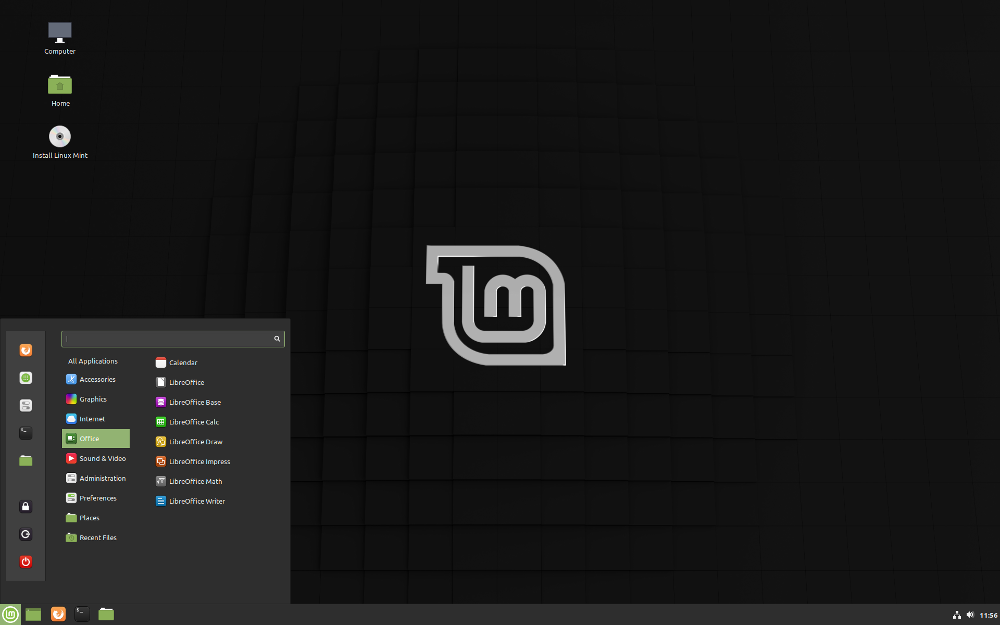
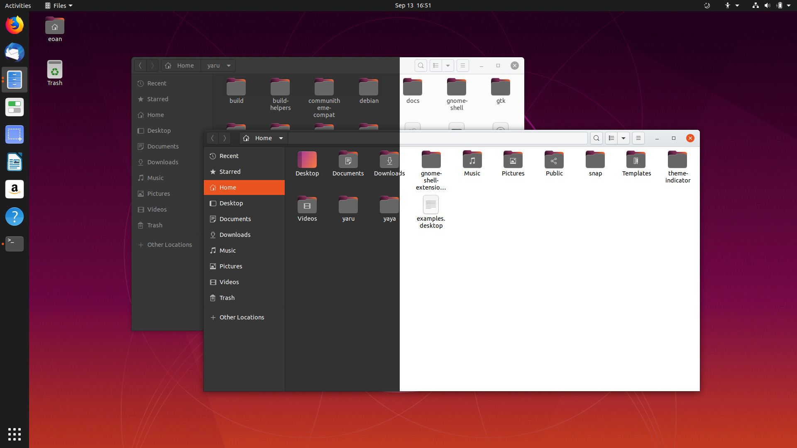
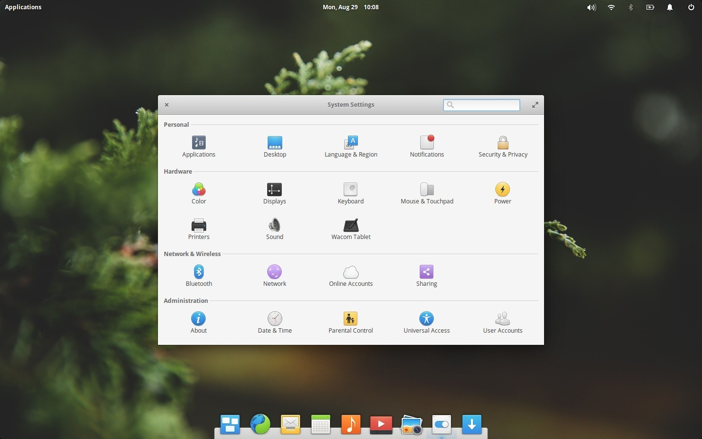
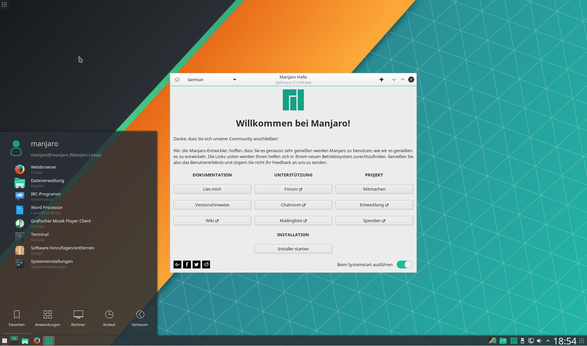
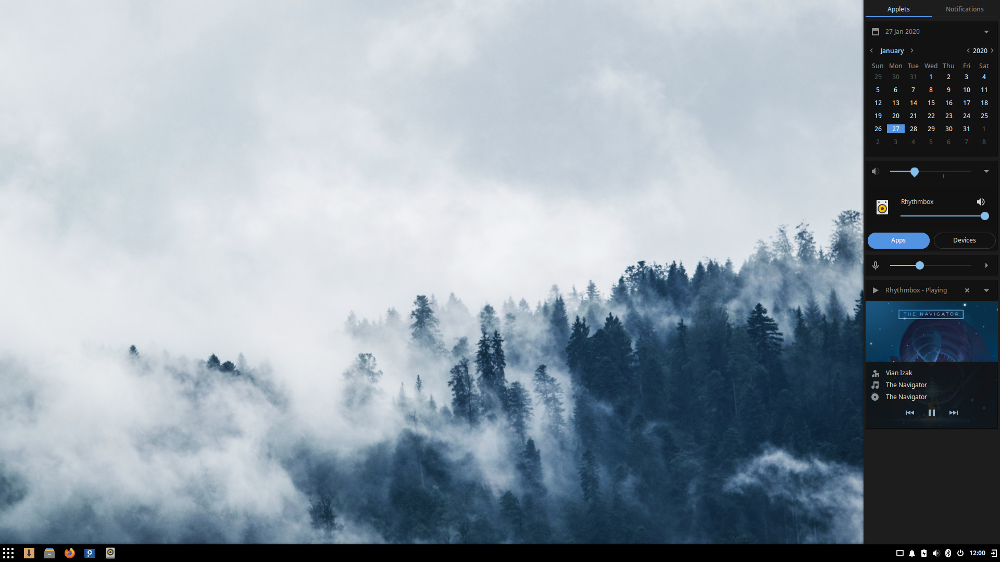

You have decided to install Linux on your system, but not sure which distro ([distribution](https://en.wikipedia.org/wiki/Linux_distribution)) to install? Don't worry. I will give you my top 5 picks of the best Linux to install.

It is too easy and obvious to get confused as there are many (believe me, many!) distributions of Linux out there; and each one of them claims to be the best. Basically, there are a few distributions which are independent (e.g. [Debian](https://www.debian.org/), [Arch Linux](https://www.archlinux.org/), [Fedora](https://getfedora.org/), [OpenSUSE](https://www.opensuse.org/) etc.), and most of all the distributions are based on those independent distros. Because Linux is Open-source, we now have thousands of distributions.

Let's get to the list of top 5 Linux distributions. The list is certainly NOT in a top-to-bottom-priority order.

## **[01: Linux Mint](https://linuxmint.com/)**

If you are coming straight from Windows, Linux Mint is what you are looking for. It is really popular, based on Ubuntu and it is very stable. It has great hardware and multimedia support and a really easy installation process; and what makes Linux Mint so great, is its community. It is currently on the top ten list of [DistroWatch](https://distrowatch.com/).

- Great for beginners who do not want to break their hardware
- Installation process is really easy
- The learning curve is short because it's designed keeping beginners in mind
- Great hardware and multimedia support
- Very stable and smooth desktop experience
- Comes pre-loaded with all the essential applications
- Great community support

Linux Mint features **3 desktop environments** as below, with their download links:

1. **Cinnamon** - [32-bit](https://linuxmint.com/edition.php?id=273) | [64-bit](https://linuxmint.com/edition.php?id=274) (Recommended)
2. **MATE** - [32-bit](https://linuxmint.com/edition.php?id=275) | [64-bit](https://linuxmint.com/edition.php?id=276)
3. **Xfce** - [32-bit](https://linuxmint.com/edition.php?id=277) | [64-bit](https://linuxmint.com/edition.php?id=278)

## [02: Ubuntu](https://ubuntu.com/download/desktop)

Ubuntu is really popular in the Linux world and a lot of distributions are based on it because it is so stable. But, it's not an independent distro, as it is based on [Debian](https://www.debian.org/). It comes with all the essential applications pre-loaded, so that you can use it straight away after installing.

- Clean and smooth desktop interactions
- Pre-loaded with all the essential day-to-day apps
- Millions of guides/tutorials available if you face any issue or problem
- Very stable and secure at its core
- Great for first time Linux installation

It ships with **Gnome desktop environment** by default, but has **[7 official desktop environments](https://ubuntu.com/download/flavours)** flavours, as they call it. But, I am going to list the most popular and best ones below: (Gnome and Ubuntu Mate are recommended)

1. **Gnome** - [64-bit](https://ubuntu.com/download/desktop/thank-you?version=20.04&architecture=amd64)
2. **Ubuntu Mate** - [32-bit](https://ubuntu-mate.org/download/i386/) | [64-bit](https://ubuntu-mate.org/download/amd64/)
3. **Xubuntu (Xfce)** - [64-bit](https://torrent.ubuntu.com/xubuntu/releases/focal/release/desktop/xubuntu-20.04-desktop-amd64.iso.torrent)
4. **Kubuntu (KDE)** - [64-bit](http://cdimage.ubuntu.com/kubuntu/releases/20.04/release/kubuntu-20.04-desktop-amd64.iso)

## [03: elementary OS](https://elementary.io/)

elementary OS is probably the best looking among the five. It has a Mac OS feel to it, but it is really clean and optimized. It is based on Ubuntu and stable enough to use as your daily production machine. It comes with almost no bloatware except some basic applications, which is a very good thing. But, you can not customize the OS as you like it, which I really don't like about it.

- Very clean and beautiful desktop experience
- Fast and optimized interactions
- Very limited customization
- Some devices face lagging issue

It comes with its own desktop environment, **Pantheon** and only supports 64-bit architecture. Click here to [download](https://elementary.io/docs/installation) it.

## [04: Manjaro](https://manjaro.org/)

Currently, Manjaro sits on the top of [DistroWatch](https://distrowatch.com/), and for good reasons. It is based on [Arch Linux](https://www.archlinux.org/), really fast and optimized, always updated with bleeding edge software. It is not for beginners, but I recommend it, because that is what I have installed as my first Linux OS and it was completely mind-blowing and stable. I am sure you will learn a lot about computers after using it, and if you run into any issues, there is huge chance that someone resolved it.

- It uses a Rolling Release Development Mode, so your system is always updated and in the fresh flesh.
- You get all the bleeding edge applications, which is really great!
- Pretty solid and stable, as it based on [Arch Linux](https://www.archlinux.org/)
- Awesome community support

Manjaro has **3 official editions** with other community based editions/desktop environments ([click here](https://manjaro.org/download/#Community)).

1. **Xfce Edition** - [64-bit](https://osdn.net/projects/manjaro/storage/xfce/20.0.3/manjaro-xfce-20.0.3-200606-linux56.iso)
2. **KDE Edition** - [64-bit](https://osdn.net/projects/manjaro/storage/kde/20.0.3/manjaro-kde-20.0.3-200606-linux56.iso)
3. **Gnome Edition** - [64-bit](https://osdn.net/projects/manjaro/storage/gnome/20.0.3/manjaro-gnome-20.0.3-200606-linux56.iso)

## [05: Solus](https://getsol.us/home/)

Solus OS is fairly new to Linux and impressed already with pretty stable independent base and a nice looking desktop environment (Budgie Desktop Environment which they have built). It is a little resource-heavy, but if you have a decent hardware it should be no problem running it.

- Own desktop environment (Budgie) which looks great
- It has a pretty stable base
- Not for old hardware (64-bit only)

Solus has **3 official editions/desktop environments** as below:

1. **Solus Budgie** \- [64-bit](https://getsol.us/download/)
2. **Solus Gnome** \- [64-bit](https://getsol.us/download/)
3. **Solus MATE** \- [64-bit](https://getsol.us/download/)

Obviously, there are so many really good Linux Distro out there. So, feel free to explore. And, thank you so much for reading.
