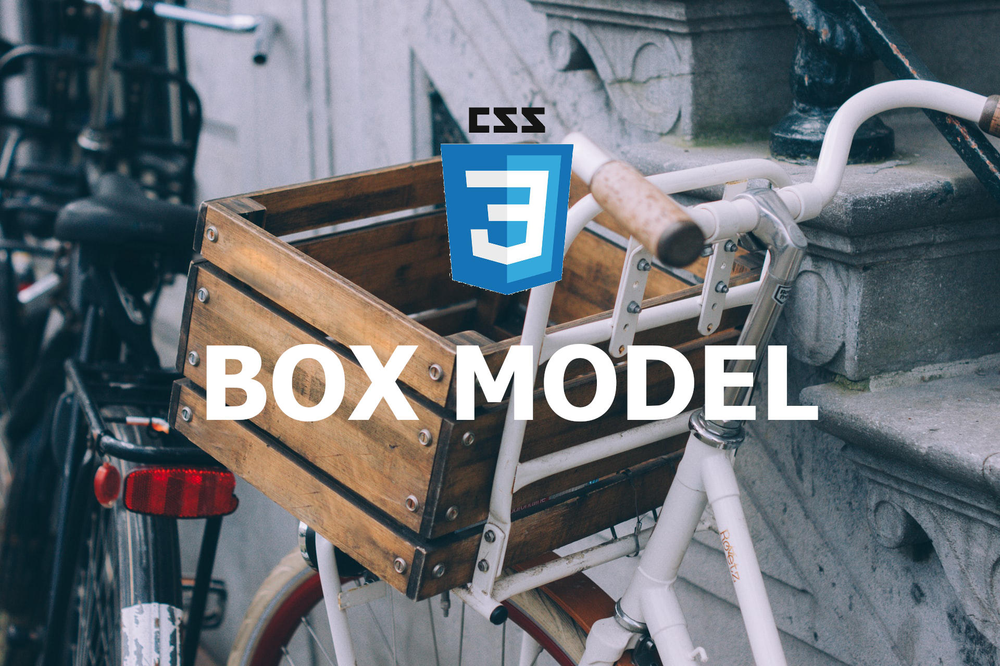

The time I understood the CSS Box Model, it was like the **hmm...** moment for me. And, I got to know how important it actually is 🤯 in order to fully understand how CSS works with the browser.

## What is 'Box Model’?

But first, do you wanna see how the boxes look like ??🤗 Right click > inspect this page, add the following piece of code:

```css
* {
  border: 1px solid red;
}
```

You can see every box on the page having its own box, surrounded by red border. Pretty cool, right? 🤓 Okay, get back to what it really is. The Box Model is how every browser know how to render all the elements of a document, like texts, images, videos etc. Good understanding of the Box Model is really important if you want to deeply understand how rendering works in browser and get a better idea of placement of elements in your website.



While rendering your web page layout containing all the elements, the browser generates a box for each and every elements which represents the _Box Model_. Every box in the page is composed of four parts or areas:

1. [Content Area](#content-area)
2. [Padding Area](#padding-area)
3. [Border Area](#border-area)
4. [Margin Area](#margin-area)

Each CSS box has a rectangular content area, a band of padding around the content, a border around the padding, and a margin outside the border. Let's look at them one by one.

## Content Area

This area is bounded by the content edge, consists of the width and the height of the actual element like heading, paragraph, image or video (the "real" content). You can explicitly define width and height of the element _(if the element is a block level element)_ by using `width`, `min-width`, `max-width`, `height`, `min-height`, and `max-height` properties.

## Padding Area

The Padding Area is bounded by the padding (top/bottom/left/right padding), which by default extends the "Content Area" to include the padding width. If you set `background-color` of the element, it will also apply to the padding area, because the padding area extends the content width and/or height.

## Border Area

This area is bounded by the border edge, and it extends the padding area to include borders for an element. This usually marks the end of the content and its boundary, so if you give `background-color` property to the element, it will not cross the border. You can set the border by short-hand property `border: 1px solid #000`.

## Margin Area

This area creates an empty area between elements, usually to separate the element from its neighbouring elements in your web page. But there are some weird things around the margin, more on this later. The size of the margin area is determined by the `margin-top`, `margin-right`, `margin-bottom`, `margin-left`, and shorthand `margin` property.

---

Of course there is more than this short explanation. There are some quirks, tricks and tweaks around the CSS Box Model, which we will discuss In my upcoming post. Till then, why don't you explore the boxes, give some element floating properties, and see what happens 😉
