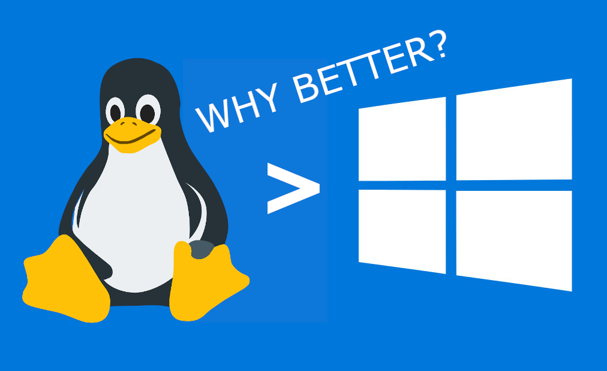
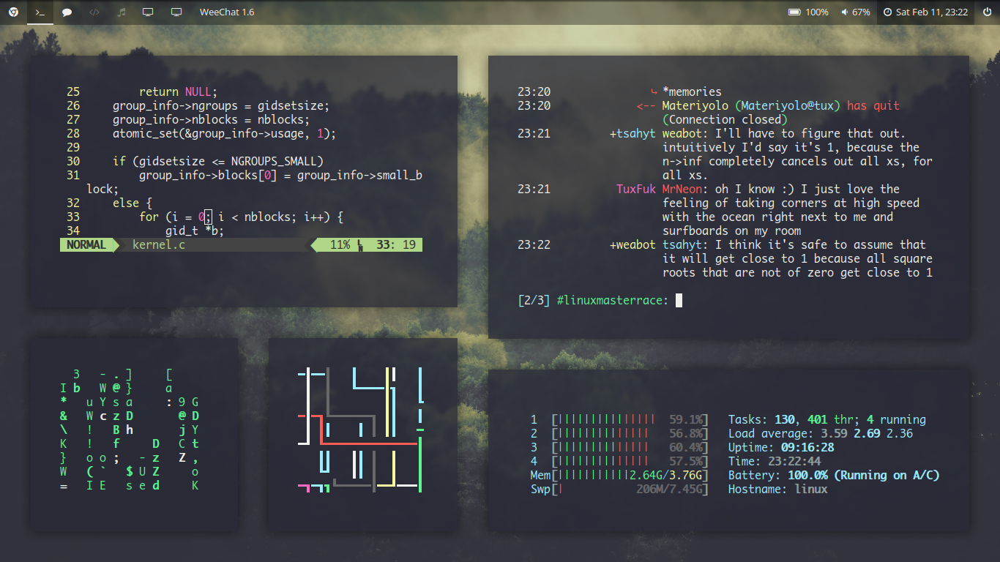
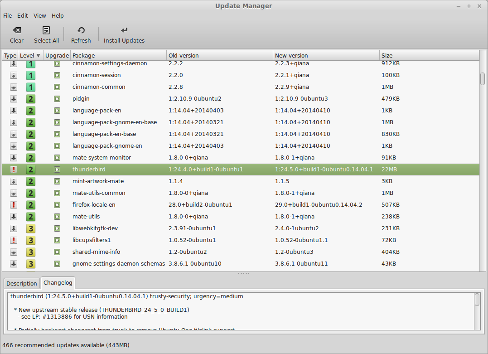

---
title: What Linux is better than Windows?
date: '2020-06-07T19:35:12.121Z'
category: 'Linux'
tags: ['Windows', 'Linux']
featuredImage: './linux-is-better-than-windows.jpeg'
---

Have you ever wondered which Operating System is better? Linux, Windows or MacOS? Well, you are not the only one. This is an ongoing debate proving which one is better for you; and, different people have different opinions on this topic. In this article, I will try to prove why Linux is a better choice for your system.

**_TLDR;_** If you want a secure, more reliable and customizable Operating System, choose Linux. Period.

## Free Forever

Unlike Windows or MacOS, you do not have to spend a single penny to use Linux. One can argue that you can install Windows 10 for free, just by installing the ISO file from the official website; and, that's true, but only if you are OKAY with Microsoft's Shady ad-revenue, and it blocking several features, like customization, without a proper license. But, that is not case with Linux, you can use Linux for free, forever.

## Security

In Linux world, the main reason why people use Linux is security. In general, Linux is way more secure in nature than Windows or MacOS. Not just because it has a more secure system architecture, but frequent security updates and less overall market share ([2.06% of the total market share](https://en.wikipedia.org/wiki/Usage_share_of_operating_systems)) makes it a really hard target for hackers, and to virus & malwares vulnerability.

## Privacy

All know Windows sends tons of users' data and usage pattern to their server, to make millions of dollar out of it, and giving excuse of improving Windows by doing so, is rather unfortunate. On the other hand, Linux sends no user data back to their server, because of the open source nature. You can use it without having to worry about your privacy.

## Customization

_Image Source Credit: [www.cyberciti.biz](https://www.cyberciti.biz/)_

Another major reason why most and I personally like Linux a lot, is customization. No other operating system can be that much customized as compared to Linux. You can change themes, icons, widgets, lock-screens, animations, and so much more. And not just the looks, you can even choose how your computer behave and tweak it as per your liking. This is simply not possible in other operating systems.

## Open Source in Nature

Linux is open source in nature. What this means is, the source code for Linux is exposed to publically for everyone. This allows quick fixes to malwares or any vulnerability, better engagement, and an amazing community.

## Freedom to Update

Yes, many people including myself hate Windows and even MacOS for its constant and repeated software updates. Don't get me wrong, the security updates/patches are important, but features updates every week? seriously??

_Image Source Credit: [Linux Mint](https://www.linuxmint.com/)_

With Linux, you have the control in your hand. You can update your system when and what you want to update. You do not want to update your system ever again? Fine! Not that I am saying you should never update your system, but you can of course do that. And Linux updates all the things together, at once, your system along with all your softwares.

## Light on your System

When you boot up Windows, the system itself easily takes around 2-3 GB of memory, which makes it really hard if you are planning to use Windows in 4 or even 8 GB of memory, or in older computers. Linux is really light on the system, so it feels smooth and brings older hardware to life. Heck, you can even use a Linux distribution in your USB.

## Stability

In Windows, you have to reboot now and then; for example, after installing/uninstalling a software, updating the system or any crash/lag. But, Linux is very stable and there is almost no chance you will ever break something. This is the reason why many programmers prefer Linux for their development purpose, and why almost all servers use Linux.

## Community & Support

And here comes the awesome part, the Linux Community. If you have any issues or problems, you can just ask on the community page and someone will help you as soon as possible. This is what makes Linux so unique.

> ### Is Linux for everyone?
>
> No, Linux is definitely not for everyone. It is just because there are some professionals who have to use Adobe products or Sketch, or someone who works in an Windows work environment, so Linux may not be a great alternative for them. But for most users Linux would be a great choice.

Thank you so much for reading! Hope you found this article helpful. If yes, please share this article with someone who needs it.
